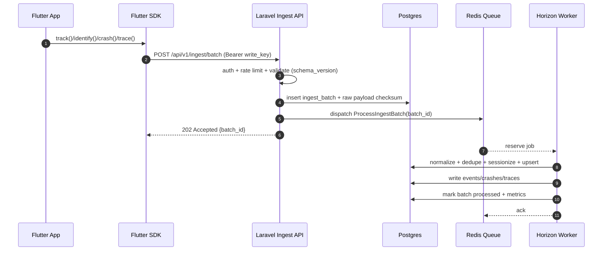
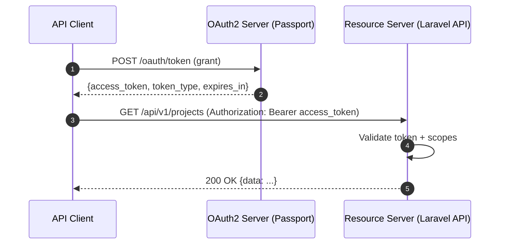

# PRD: Laravel-Based Mobile App Analytics Platform for Flutter-First Apps

## Executive summary

This PRD specifies an MVP for a multi-tenant, Laravel-based app-analytics system that provides event analytics, sessionization, user properties, crash reporting, and performance tracing for mobile apps—starting with Flutter, with a forward-compatible path to React Native and other runtimes. The system is designed as a “secure-by-default analytics backbone” with explicit operational guardrails (rate limiting, queue observability, privacy workflows) and an intentionally non-stock UI layer (custom design system; no default Jetstream look-and-feel). citeturn17view0turn12search10

The technical baseline is **Laravel 12.x (current stable major version as of Feb 23, 2026)**, with PHP support spanning **8.2–8.5**; this aligns with a modern runtime footprint and supports enterprise-grade maintainability expectations. citeturn17view0turn0search30

The product must include:

- **Jetstream** for authentication scaffolding, **Teams**, **API token UI**, **Email verification**, and **Dark-mode scaffolding** (while still delivering a custom UX system and non-stock appearance). Jetstream’s authentication stack is powered by **Fortify**, and its API token feature integrates with **Sanctum**. citeturn6search1turn4search18turn6search5turn6search0turn5view0turn6search2  
- **Horizon** for queue operations visibility and code-driven configuration on Redis-backed queues. citeturn11search4turn0search2  
- **Pennant** for feature flags across product, platform, and rollout strategy. citeturn0search9turn0search17  
- **Social login** for entity["company","GitHub, Inc.","code hosting company"] (priority) and entity["company","Google LLC","internet company"] via Socialite-compatible providers. citeturn1search12turn1search3  
- **Pest** for full test coverage, with a hard quality gate: *all tests must pass in CI* and coverage targets must be met. (Pest itself requires PHP 8.3+.) citeturn14search5turn1search15  
- A billing *placeholder* model and UI surfaces. **Laravel Spark integration is explicitly excluded from the MVP** (no Spark coupling; no Spark migrations; no Spark UI assumptions).  
- A deliberate awareness that **Laravel’s new starter kits supersede Breeze/Jetstream for future feature work**; Jetstream remains the mandated scaffold here, but should be treated as a bootstrap layer that the product UI overrides and ultimately abstracts away from. citeturn17view0turn4search20turn12search10  

## Product strategy and success definition

**Problem statement (business lens).** Mobile teams need reliable, privacy-aware analytics that is controllable (self-managed or single-tenant deployable), with unified telemetry across product events, stability (crashes), and UX performance. Off-the-shelf analytics often creates trade-offs in cost, data residency, PII governance, and vendor lock-in. The MVP should optimize for “time-to-first-insight” (TTFI) while maintaining compliance pathways and operational observability from day one.

**Target users and primary jobs-to-be-done.**  
- Engineering leads: instrument events fast, trust data quality, debug ingestion failures, and operate the system predictably.  
- Product managers: funnel/retention insights, feature adoption, cohort behavior.  
- QA / release managers: crash trends per release, regression detection, and performance degradation visibility.  
- Data/analytics engineers (later): exports, APIs, schema evolution, and warehouse integrations.

**High-level product goals (north-star + guardrails).**  
- **North-star outcome:** Teams can instrument a Flutter app and get meaningful dashboards (events + sessions + crashes + traces) within one working day, with stable ingestion and clear governance rails.  
- **Operational guardrails:** predictable queue processing, debuggable failures (Horizon), and explicit rate limiting. citeturn11search4turn11search1

**Success metrics (MVP scorecard).**  
- Activation: % of created projects that send ≥ 1,000 events within 24 hours of SDK install.  
- Ingestion reliability: p99 ingest API success rate, queue failure rate, and % of events dropped due to schema violations (should trend down as SDK matures).  
- Latency: p95 “event received → queryable in UI” time (target: minutes, not hours; strict “near-real-time” is not required for MVP).  
- Data quality: event dedupe rate, sessionization correctness KPIs (e.g., % events assigned to a session), and crash report completeness.  
- UX performance: dashboard p95 query time for common views (overview, event explorer, crash list).  
- Compliance SLA: ability to complete deletion/export requests within internal policy timelines, mapped to GDPR/CCPA requirements. citeturn8search4turn8search1turn8search2turn8search9  

## MVP functional scope and API contracts

**MVP feature list (capability contract).**

**Account, workspace (Teams), and onboarding**  
- Email/password auth + social login (GitHub first, Google second) implemented with Socialite-supported providers. citeturn1search12turn1search3  
- Email verification must be enabled and enforced via `verified` middleware for the dashboard. Jetstream/Fortify scaffolding supports email verification; enabling is configured via Jetstream/Fortify features. citeturn6search1turn6search0turn16view0  
- Teams as the canonical “organization/workspace” model (Jetstream Teams). citeturn4search18turn0search6  
- Invitations, member roles, and team switching (Jetstream). citeturn4search18turn1search7  

**Project model**  
- Each team can create multiple **Projects** (e.g., “MyApp iOS/Android”), each with one or more **Environments** (prod, staging, dev).  
- Each environment has **ingestion credentials** and rules (rate limits, retention windows, allowed domains/bundle IDs).  
- Each project/environment has “data governance knobs”: PII allowlist/denylist, IP truncation flag, user-id hashing mode.

**Flutter ingestion SDK (MVP must ship)**  
The Flutter SDK must support these telemetry types:

- **Events:** custom events with properties, context (device/app), timestamps, and idempotency keys.  
- **Sessions:** auto session start/stop based on lifecycle signals; support manual session override. Flutter lifecycle hooks can be implemented via `WidgetsBindingObserver.didChangeAppLifecycleState`. citeturn7search2turn7search6  
- **User properties:** identify/alias plus mutable properties with explicit operation semantics (set, set_once, increment, unset).  
- **Crash reports:** capture Flutter framework errors via `FlutterError.onError` and “root isolate” unhandled errors via `PlatformDispatcher.onError`. citeturn7search1turn7search5  
- **Performance traces:** capture app-defined spans/traces; optionally integrate with Dart `Timeline` instrumentation for CPU/wall-time segments. citeturn7search26turn7search18  

**Server-side ingestion + processing**  
- REST ingest endpoints (batching, validation, 202-accepted semantics, idempotency).  
- Queue-based processing with Redis + Horizon (monitorable throughput, runtime, failures). citeturn11search4turn11search0  
- Schema validation using Laravel’s validation system (Form Requests preferred) with clear error payloads for SDK debugging. citeturn11search2turn11search32  

**Analytics UI (MVP dashboards)**  
- Overview dashboard per project/environment: event volume, active users, sessions, crash-free rate, p95 trace durations.  
- Event explorer: filter by name, time range, properties, user/session.  
- Sessions explorer: timeline, entry events, and device/app context.  
- Crash explorer: grouped by fingerprint, release, device/OS; show stack trace + breadcrumbs.  
- Performance explorer: traces by name, p50/p95, breakdown by app version.

**Billing placeholder (explicitly not Spark)**  
- Plans table (Free/Trial/Pro/Enterprise) + per-team subscription state, entitlements, and “upgrade CTA” surfaces.  
- No payment provider wiring in MVP. No Spark models or UI.

**Feature gating**  
- Pennant flags must gate: beta dashboards, React Native SDK enablement, “advanced retention”, and export features. Pennant is the first-party feature flag solution to implement this. citeturn0search9turn0search17  

**Non-stock/custom UI mandate**  
Jetstream is a scaffold, not the visual identity. Jetstream explicitly positions its published views/pages as customizable starting points; authentication views can be customized via Fortify hooks where needed. citeturn12search10turn12search5  
Dark mode should use Tailwind’s class-based approach with a persisted user preference (e.g., localStorage) and/or a stored server preference; Tailwind documents the `dark` class mechanism and common persistence patterns. citeturn13search0turn13search0  

### API contracts (REST/JSON)

This PRD defines contracts that a code-generation agent can implement without ambiguity.

#### Authentication model: OAuth2 + Bearer tokens, plus Jetstream/Sanctum for first-party UI

- **Dashboard (first-party web)**: Jetstream session auth for browser flows; Jetstream API token UI uses Sanctum personal access tokens (Bearer tokens). citeturn6search5turn6search2turn6search1  
- **Programmatic API access**: OAuth2 via Laravel Passport for service accounts and third-party integrations (e.g., exporting metrics). Laravel Passport is a first-party OAuth2 server implementation for Laravel. citeturn10search3turn10search0  
- **Bearer token handling**: Per RFC 6750, any party holding the bearer token can access protected resources; tokens must be protected in transport (TLS) and storage. citeturn10search1  
- **Optional JWT format**: JWT is a standardized compact claims container (RFC 7519) and may be used as an OAuth2 bearer token format if the architecture later demands stateless validation. citeturn10search2turn10search35  

> MVP decision: keep ingestion credentials as opaque “project write keys” (rotatable, revocable), while implementing OAuth2 (Passport) for the query/export API. This avoids unsafe mobile client secrets while still meeting “JWT/OAuth2” requirements through the programmatic surface.

#### Social login endpoints (GitHub priority; Google second)

Social authentication is implemented via Socialite. Socialite supports both GitHub and Google among other providers. citeturn1search12turn1search3  

**Routes (conceptual):**
```php
// routes/web.php

Route::get('/auth/github/redirect', [SocialAuthController::class, 'redirectGithub'])
  ->name('auth.github.redirect');

Route::get('/auth/github/callback', [SocialAuthController::class, 'callbackGithub'])
  ->name('auth.github.callback');

Route::get('/auth/google/redirect', [SocialAuthController::class, 'redirectGoogle'])
  ->name('auth.google.redirect');

Route::get('/auth/google/callback', [SocialAuthController::class, 'callbackGoogle'])
  ->name('auth.google.callback');
```

**Expected behavior (contract):**  
- Redirect endpoint initiates OAuth flow, uses state/CSRF protection, and redirects back to the app.  
- Callback endpoint exchanges code for provider identity, matches/creates internal user, links provider identity, signs user in (Jetstream/Fortify), and enforces email verification rules (if provider doesn’t assert verified email, force verification).

#### Ingestion API

**Endpoint:** `POST /api/v1/ingest/batch`  
**Auth:** `Authorization: Bearer <project_write_key>` (opaque, revocable); rate limited per project/environment using Laravel rate limiting. citeturn11search1  

**Headers:**  
- `Authorization: Bearer <project_write_key>`  
- `Content-Type: application/json`  
- `X-SDK: flutter`  
- `X-SDK-Version: 0.1.0`  
- `X-Schema-Version: 1.0`  
- `Idempotency-Key: <uuid>` (optional; recommended)

**Request body example:**
```json
{
  "schema_version": "1.0",
  "sent_at": "2026-02-23T09:45:12.120Z",
  "environment": "prod",
  "app": {
    "bundle_id": "com.example.myapp",
    "version_name": "2.3.1",
    "build_number": "231"
  },
  "device": {
    "device_id": "a4e0b3b1-3b13-4d45-95c3-4a598a7c2cb1",
    "platform": "android",
    "os_version": "14",
    "model": "Pixel 8"
  },
  "user": {
    "anonymous_id": "anon_1f7a5cbd",
    "user_id": "u_12345"
  },
  "events": [
    {
      "type": "event",
      "event_id": "018d7a9b-1b4b-7d5b-9a45-0a2f3d8c0f14",
      "name": "screen_view",
      "timestamp": "2026-02-23T09:45:09.012Z",
      "session_id": "sess_018d7a96",
      "properties": {
        "screen": "Home",
        "referrer": "push_notification"
      }
    },
    {
      "type": "user_properties",
      "event_id": "018d7a9b-1c2d-7c91-9a45-0a2f3d8c0f88",
      "timestamp": "2026-02-23T09:45:09.100Z",
      "session_id": "sess_018d7a96",
      "operations": [
        { "op": "set", "key": "plan", "value": "trial" },
        { "op": "set_once", "key": "signup_source", "value": "organic" }
      ]
    },
    {
      "type": "crash",
      "event_id": "018d7a9b-2aa1-7a12-9a45-0a2f3d8c0f99",
      "timestamp": "2026-02-23T09:45:10.000Z",
      "fatal": true,
      "fingerprint": "flutter:NoSuchMethodError:xyz",
      "exception": {
        "type": "NoSuchMethodError",
        "message": "The method 'foo' was called on null.",
        "stacktrace": "..."
      },
      "breadcrumbs": [
        { "ts": "2026-02-23T09:45:08.900Z", "type": "ui", "message": "tap:login_button" }
      ]
    },
    {
      "type": "trace",
      "event_id": "018d7a9b-2bb2-7a12-9a45-0a2f3d8c0f00",
      "timestamp": "2026-02-23T09:45:11.000Z",
      "trace": {
        "trace_id": "tr_018d7a9b33",
        "name": "cold_start",
        "duration_ms": 842,
        "attributes": { "network": "wifi" }
      }
    }
  ]
}
```

**Response example (202 Accepted):**
```json
{
  "batch_id": "bat_018d7aa012",
  "received_at": "2026-02-23T09:45:12.340Z",
  "accepted": 4,
  "rejected": 0,
  "warnings": []
}
```

**Error response example (422 Unprocessable Entity):**
```json
{
  "error": "validation_failed",
  "message": "Invalid payload",
  "details": {
    "events.0.name": ["The name field is required when type=event."],
    "schema_version": ["Unsupported schema_version. Supported: 1.0"]
  }
}
```

This endpoint must validate payloads using Laravel’s validation mechanics (Form Requests encouraged) and return predictable JSON error structures. citeturn11search2turn11search32  

#### Query API (metrics + exploration)

**Endpoint:** `GET /api/v1/projects/{project_id}/metrics/overview?from=...&to=...&env=prod`  
**Auth:** OAuth2 bearer token (Passport) or Sanctum token for first-party UI. Passport is a first-party OAuth2 server for Laravel and aligns with RFC 6749 flows and RFC 6750 bearer usage. citeturn10search3turn10search0turn10search1turn6search2  

**Response example:**
```json
{
  "project_id": "prj_01",
  "environment": "prod",
  "window": { "from": "2026-02-16T00:00:00Z", "to": "2026-02-23T00:00:00Z" },
  "kpis": {
    "events": 1283412,
    "active_users": 53210,
    "sessions": 88412,
    "crash_free_users_pct": 99.2,
    "p95_cold_start_ms": 910
  },
  "timeseries": {
    "daily_active_users": [
      { "date": "2026-02-16", "value": 49810 },
      { "date": "2026-02-17", "value": 50120 }
    ]
  }
}
```

#### Sample Laravel route map (API)

```php
// routes/api.php

Route::prefix('v1')->group(function () {
  // Ingestion (project write keys + throttling)
  Route::middleware(['throttle:ingest'])
    ->post('/ingest/batch', [IngestController::class, 'batch']);

  // Programmatic API (OAuth2 / Passport)
  Route::middleware(['auth:api'])
    ->group(function () {
      Route::get('/projects', [ProjectController::class, 'index']);
      Route::post('/projects', [ProjectController::class, 'store']);

      Route::get('/projects/{project}/metrics/overview', [MetricsController::class, 'overview']);
      Route::get('/projects/{project}/events', [EventsController::class, 'search']);
      Route::get('/projects/{project}/crashes', [CrashesController::class, 'search']);
      Route::get('/projects/{project}/traces', [TracesController::class, 'search']);

      // Billing placeholder
      Route::get('/billing/plans', [BillingController::class, 'plans']);
      Route::get('/billing/subscription', [BillingController::class, 'subscription']);
    });
});
```

## Data model, storage strategy, and event pipeline architecture

### Core data model (multi-tenant)

Jetstream Teams provide the baseline multi-tenancy model: users belong to multiple teams; each team owns projects. citeturn4search18turn0search6  

**Domain entities (MVP):**  
- **Team** (Jetstream)  
- **Project** (team-owned)  
- **Environment** (project-owned; e.g., prod/staging)  
- **ProjectKey** (write key, read key; revocable; scope-limited)  
- **AppUser** (project-scoped user identity: anonymous_id + user_id + hashed mapping)  
- **Device** (project-scoped device identifier)  
- **Session** (per device/user; start/end; derived + explicit)  
- **Event** (normalized telemetry)  
- **CrashReport** (fingerprinted; includes stacktrace, breadcrumbs)  
- **Trace** (name + duration; optional spans later)  
- **FeatureFlag** (Pennant driver tables) citeturn0search9  
- **BillingSubscription** (placeholder)  
- **DataExportJob / DataDeletionRequest** (compliance workflow)

### MVP database schema (Postgres-first)

**MVP storage recommendation:** Postgres as the primary system of record for metadata + low/medium-scale telemetry, with a deliberate abstraction boundary to add an OLAP store later. Postgres supports `jsonb` for flexible properties and can index `jsonb` effectively via GIN with operator-class trade-offs. citeturn9search4turn9search0turn9search16  

**Schema (tables + indexes; abbreviated but implementable):**

- `projects`  
  - `id (uuid pk)`, `team_id (fk teams)`, `name`, `platform_primary (enum: flutter, rn, etc)`, `created_at`  
  - Indexes: `(team_id, created_at)`

- `environments`  
  - `id`, `project_id`, `name (prod/staging/dev)`, `retention_days_raw`, `retention_days_agg`, `pii_mode`, `created_at`  
  - Unique index: `(project_id, name)`

- `project_keys`  
  - `id`, `environment_id`, `key_type (write/read)`, `token_hash`, `revoked_at`, `last_seen_at`  
  - Indexes: `(environment_id, key_type)`, `(token_hash)` (unique)

- `app_users`  
  - `id`, `environment_id`, `anonymous_id`, `user_id`, `user_id_hash`, `first_seen_at`, `last_seen_at`  
  - Indexes: `(environment_id, anonymous_id) unique`, `(environment_id, user_id_hash)`

- `devices`  
  - `id`, `environment_id`, `device_id`, `platform`, `os_version`, `model`, `first_seen_at`, `last_seen_at`  
  - Index: `(environment_id, device_id) unique`

- `sessions`  
  - `id`, `environment_id`, `session_key`, `app_user_id`, `device_id`, `started_at`, `ended_at`, `duration_ms`  
  - Indexes: `(environment_id, started_at desc)`, `(environment_id, app_user_id, started_at desc)`

- `events`  
  - `id`, `environment_id`, `event_id (uuid)`, `type (enum)`, `name`, `timestamp`, `session_id`, `app_user_id`, `device_id`, `properties (jsonb)`, `schema_version`  
  - Indexes:  
    - `(environment_id, timestamp desc)`  
    - `(environment_id, name, timestamp desc)`  
    - `(environment_id, app_user_id, timestamp desc)`  
    - `GIN (properties)` for ad-hoc property filters (MVP) citeturn9search4turn9search0  

- `crash_reports`  
  - `id`, `environment_id`, `event_id`, `fingerprint`, `fatal`, `exception_type`, `message`, `stacktrace (text)`, `breadcrumbs (jsonb)`, `app_version`, `timestamp`  
  - Indexes: `(environment_id, fingerprint, timestamp desc)`, `(environment_id, timestamp desc)`

- `traces`  
  - `id`, `environment_id`, `trace_id`, `name`, `duration_ms`, `timestamp`, `attributes (jsonb)`, `app_version`  
  - Indexes: `(environment_id, name, timestamp desc)`, `(environment_id, duration_ms desc)`

### Storage option trade-off table (MVP and scale path)

| Option | Strengths (analytics context) | Key risks / trade-offs | Best-fit phase |
|---|---|---|---|
| Postgres (row store + jsonb) | Strong operational DB for metadata; flexible `jsonb`; supports GIN indexes for jsonb queries. citeturn9search4turn9search0 | Property filtering at high cardinality can become expensive; OLAP queries may need aggressive pre-aggregation. | MVP + early scale |
| ClickHouse (columnar OLAP) | Explicitly designed for fast analytics (e.g., `GROUP BY`) and OLAP workloads; supports TTL-based lifecycle management. citeturn9search11turn9search1turn9search5 | Operational complexity (cluster ops); different modeling patterns than Postgres; eventual consistency for TTL application unless forced merges. citeturn9search5turn9search21 | Scale phase (high event volume) |
| BigQuery (warehouse) | Partition pruning improves performance and cost control; supports partition expiration for retention governance; clustering optimizes scans by column locality. citeturn9search2turn9search6turn9search18 | External dependency + cost model; streaming ingestion patterns introduce quota/ops considerations. citeturn9search2 | Enterprise / data warehouse integration |

### Event schema versioning (contract durability)

Schema versioning is mandatory because mobile clients upgrade gradually and must remain compatible over time.

| Strategy | Description | Pros | Cons | MVP recommendation |
|---|---|---|---|---|
| Single schema with optional fields | One payload shape, fields evolve with soft optionality | Simple | Hard to deprecate fields cleanly | Not sufficient alone |
| Explicit `schema_version` + server adapters | Client sends `schema_version`; server adapts/normalizes before processing | Controlled evolution, safe backcompat | Requires mapping layer | **Yes (MVP)** |
| Multiple endpoints per version (`/v1`, `/v2`) | Endpoint versioning | Clear separation | Endpoint sprawl | Later, if needed |

### Pipeline architecture (ingest → validate → queue → process → store)

**Queue system.** Laravel queues should use Redis for production and be operated through Horizon, which provides metrics such as throughput, runtime, and failures. citeturn11search4turn11search0turn0search2  

**Rate limiting.** Apply route-level ingest throttles per environment/project using Laravel’s rate limiting facilities. citeturn11search1turn11search27  

**Mermaid sequence diagram: ingestion flow**


**Processing steps (batch job).**  
- Validate and normalize timestamps, IDs, and required fields. (Laravel validation supports structured request validation patterns.) citeturn11search2  
- Deduplicate based on `(environment_id, event_id)` unique constraint or a “seen events” table.  
- Sessionize: attach events to session_id; if missing, infer by device/user and lifecycle markers.  
- Apply PII policy: drop/transform forbidden keys and enforce allowlist/denylist.  
- Persist normalized records; update derived aggregates (daily active users, crash-free rate, p95 trace).  
- Emit internal events for audit/monitoring (optional); Laravel supports queued event listeners where appropriate. citeturn11search26  

## Privacy, compliance, security, and governance

### Retention model (product + technical knobs)

Retention must be configurable per environment and enforceable at storage level.

- Raw events retention (e.g., 30–90 days)  
- Aggregates retention (e.g., 13 months)  
- Crash reports retention (e.g., 90 days, with redaction policy)  
- Performance traces retention (e.g., 30 days raw, aggregated percentiles longer)

If/when ClickHouse is introduced, TTL policies can delete/move/roll up data automatically after a specified interval; TTL is defined in table DDL and applied during merges (with operational controls like `merge_with_ttl_timeout`). citeturn9search1turn9search5turn9search21  
If BigQuery is used, partition expiration can delete partitions automatically, and clustering/partitioning improves performance and cost predictability. citeturn9search2turn9search6  

### GDPR requirements (must be productized)

Under GDPR, the platform must support:

- **Right to erasure** (“right to be forgotten”), requiring deletion of personal data without undue delay when applicable. citeturn8search4  
- **Right to data portability**: ability to provide personal data in a portable format and transmit it. citeturn8search1  

**Product implications (explicit requirements):**  
- “Delete user data” workflow per environment/project keyed by `user_id` and/or `anonymous_id`.  
- Configurable deletion scope: full delete (events + sessions + crashes linked to user), or pseudonymize (strip user fields but keep aggregates where lawful).  
- Export workflow: produce a machine-readable archive containing user profile properties, event history (within retention), and crash reports connected to the data subject.

### CCPA requirements (must be productized)

CCPA requires a consumer **right to delete** personal information collected from the consumer. citeturn8search2  
The California Attorney General summarizes key consumer rights including the **right to know** and **right to delete** (with exceptions). citeturn8search9  

**Product implications (explicit requirements):**  
- “Delete request” pipeline that can be triggered by an admin, and logs a verifiable deletion action.  
- “Right to know” export that includes categories/specific data where applicable.

### Security considerations (auth, token handling, rate limits, secrets)

**Social login security.** Socialite provides provider-based OAuth authentication; implementation must enforce strict redirect URI handling, state validation, and controlled account linking semantics. citeturn1search12turn1search3  

**Bearer token risk model.** RFC 6750 explicitly documents that any bearer holding a bearer token can use it, so tokens require protection in storage and in transit (TLS). citeturn10search1  

**OAuth2 for programmatic API access.** OAuth2 core flows and roles are defined in RFC 6749; Passport is Laravel’s first-party OAuth2 server implementation, built to provide an OAuth2 server in a Laravel app. citeturn10search0turn10search3  

**JWT usage (optional but spec-aligned).** JWT is defined by RFC 7519 as a compact, URL-safe claim representation. citeturn10search2  

**Rate limits as a first-class control.** Laravel provides a RateLimiter facade and throttle middleware patterns; ingest endpoints must be protected by project-level limits and abuse controls. citeturn11search1turn11search27  

**Secrets and encryption at rest.**  
- Encrypt any stored “provider access tokens” (if retained) and sensitive credentials using Laravel encryption, which uses OpenSSL AES encryption and signs encrypted values with a MAC to prevent tampering. citeturn11search5  
- Password storage uses secure hashing via Laravel’s Hash facade (bcrypt/Argon2). citeturn11search7  

### SDK privacy & crash/performance capture controls (Flutter)

The SDK must support opt-out, sampling, and redaction features because errors and traces can contain sensitive data (URLs, user-entered values, stack traces).

- Crash capture must use Flutter’s documented error routing: framework-caught errors flow through `FlutterError.onError`, and errors outside Flutter callbacks can be handled by `PlatformDispatcher.onError`. citeturn7search1turn7search5  
- Sessionization must use lifecycle changes signaled by `didChangeAppLifecycleState`. citeturn7search2  
- Performance tracing for arbitrary code segments can be done using Dart Timeline utilities, as documented by Flutter’s debugging guidance. citeturn7search26turn7search18  

## Quality bar: testing, CI/CD, and release readiness

### Testing strategy (Pest-first, full coverage)

**Framework baseline.** Laravel supports running tests via `vendor/bin/pest`, `vendor/bin/phpunit`, and `php artisan test`. citeturn1search15  
Pest installation is standardized and requires PHP 8.3+. citeturn14search5turn17view0  

**Jetstream test coverage.** Jetstream installation scaffolds feature tests; the Jetstream install command can install Pest and the Laravel Pest plugin and wires in auth/email verification tests. citeturn14search0turn16view0  

**Coverage targets (quality gates).**  
- Unit: ≥ 90% of core domain services (ingest validation, normalization, sessionization, PII filtering).  
- Integration: ≥ 80% of ingest controller + queue jobs + DB persistence paths.  
- Contract tests: ensure API request/response contract compatibility across schema versions.  
- End-to-end: smoke tests for “sign up → verify email → create project → ingest events → dashboard shows data”.

### Example Pest tests (contract-level)

**Ingest validation and acceptance (Feature test)**
```php
<?php

use Illuminate\Support\Str;

it('accepts a valid ingest batch and returns 202 with a batch_id', function () {
    $writeKey = 'test_write_key';
    $payload = [
        'schema_version' => '1.0',
        'sent_at' => now()->toIso8601String(),
        'environment' => 'prod',
        'app' => ['bundle_id' => 'com.example.myapp', 'version_name' => '1.0.0', 'build_number' => '100'],
        'device' => ['device_id' => (string) Str::uuid(), 'platform' => 'android', 'os_version' => '14', 'model' => 'Pixel'],
        'user' => ['anonymous_id' => 'anon_123', 'user_id' => 'u_1'],
        'events' => [[
            'type' => 'event',
            'event_id' => (string) Str::uuid(),
            'name' => 'screen_view',
            'timestamp' => now()->subSecond()->toIso8601String(),
            'session_id' => 'sess_1',
            'properties' => ['screen' => 'Home'],
        ]],
    ];

    $response = $this->withHeaders([
        'Authorization' => "Bearer {$writeKey}",
        'X-SDK' => 'flutter',
        'X-SDK-Version' => '0.1.0',
        'X-Schema-Version' => '1.0',
    ])->postJson('/api/v1/ingest/batch', $payload);

    $response->assertAccepted()
        ->assertJsonStructure(['batch_id', 'received_at', 'accepted', 'rejected', 'warnings']);
});
```

**Rate limiting (Feature test)**
```php
<?php

it('rate limits ingest requests per project key', function () {
    $writeKey = 'test_write_key';

    // Make N+1 requests quickly; expect 429 at the threshold.
    for ($i = 0; $i < 120; $i++) {
        $this->withHeaders(['Authorization' => "Bearer {$writeKey}"])
            ->postJson('/api/v1/ingest/batch', [
                'schema_version' => '1.0',
                'sent_at' => now()->toIso8601String(),
                'environment' => 'prod',
                'app' => ['bundle_id' => 'com.example.myapp', 'version_name' => '1.0.0', 'build_number' => '100'],
                'device' => ['device_id' => 'd1', 'platform' => 'android', 'os_version' => '14', 'model' => 'Pixel'],
                'user' => ['anonymous_id' => 'anon_123'],
                'events' => [],
            ]);
    }

    $this->withHeaders(['Authorization' => "Bearer {$writeKey}"])
        ->postJson('/api/v1/ingest/batch', [
            'schema_version' => '1.0',
            'sent_at' => now()->toIso8601String(),
            'environment' => 'prod',
            'app' => ['bundle_id' => 'com.example.myapp', 'version_name' => '1.0.0', 'build_number' => '100'],
            'device' => ['device_id' => 'd1', 'platform' => 'android', 'os_version' => '14', 'model' => 'Pixel'],
            'user' => ['anonymous_id' => 'anon_123'],
            'events' => [],
        ])->assertStatus(429);
});
```

These tests assume the platform uses Laravel’s standard throttling/rate limiting primitives. citeturn11search1turn11search27  

### CI/CD pipeline (release gates)

**Minimum CI gates (non-negotiable):**  
- Install dependencies; build assets (Vite); run migrations. Laravel uses Vite for asset bundling in modern versions. citeturn12search13  
- Run all tests with `vendor/bin/pest` (no skipped suites) and enforce coverage thresholds. citeturn1search15turn14search5  
- Static quality gates (recommended): formatting checks, static analysis, and dependency vulnerability scanning.

**Release readiness definition:**  
- All tests green; no high/critical security findings; Horizon dashboard confirms stable queue throughput and failure rate thresholds. citeturn11search4  

## Roadmap, operations, and delivery plan

### Roadmap (React Native support + Pennant-driven rollout)

**React Native support path.**  
- Build a React Native SDK that matches the same ingest contract (`schema_version` preserved), with parity for events, sessions, user properties, crashes, and traces.  
- Maintain SDK portability via a shared “analytics spec” and conformance tests (contract tests for payload normalization).

**Pennant feature flags as rollout control plane.**  
Pennant provides a lightweight feature flag approach; the roadmap requires Pennant flags for:  
- `sdk.react_native.enabled` (team/project scoped)  
- `dashboard.performance.enabled`  
- `exports.enabled`  
- `retention.advanced.enabled` citeturn0search9turn0search17  

### Operational runbook (monitoring, alerts, scaling)

**Queue operations and monitoring.**  
Horizon provides a dashboard and code-driven configuration for Redis queues, including metrics like throughput, runtime, and failures. citeturn11search4turn0search2  
Runbook requirements:  
- Alert on sustained job failure spikes, high retry rates, and increasing job runtimes.  
- Maintain a “dead letter” workflow (failed jobs table) and an operator playbook for replaying or quarantining malformed payloads.

**Scaling approach (phased).**  
- Phase A (MVP): single Postgres + Redis, horizontally scale Laravel web workers and queue workers. Laravel’s Redis queue driver supports blocking configuration to reduce inefficient polling. citeturn11search0  
- Phase B (growth): introduce an OLAP store (ClickHouse) for event/query workloads, keep Postgres for metadata. ClickHouse is positioned as OLAP vs Postgres as OLTP for transactional workloads. citeturn9search11turn9search27  
- Phase C (enterprise): optional warehouse export (BigQuery) for organizations with existing GCP analytics stacks, leveraging partitioning/clustering for cost/performance governance. citeturn9search2turn9search6  

### Auth flow diagrams (social login and token usage)

**Mermaid sequence diagram: social login (GitHub)**
```mermaid
sequenceDiagram
  autonumber
  participant U as User (Browser)
  participant W as Web App (Jetstream UI)
  participant A as Laravel Auth (Fortify + Socialite)
  participant P as OAuth Provider

  U->>W: Click "Continue with GitHub"
  W->>A: GET /auth/github/redirect
  A-->>P: Redirect with state + scopes
  U->>P: Authenticate + consent
  P-->>A: GET /auth/github/callback?code=...
  A->>P: Exchange code for access token
  A->>P: Fetch user profile + verified email (if available)
  A->>A: Link or create user; enforce team model
  A-->>W: Set session + redirect /dashboard
```

This uses Socialite’s provider pattern to implement OAuth authentication. citeturn1search12turn1search3  

**Mermaid sequence diagram: OAuth2 token for programmatic API**


OAuth2 is defined by RFC 6749; bearer token usage is defined by RFC 6750; Passport provides an OAuth2 server implementation in Laravel. citeturn10search0turn10search1turn10search3  

### Deliverables, milestones, and estimated effort (MVP)

Assuming an open-ended budget and a product-minded delivery model, this MVP is best structured as epics with integration checkpoints rather than a “big bang” release.

| Epic | Deliverables | Est. effort (person-weeks) |
|---|---|---:|
| Platform foundation | Laravel 12 baseline; Jetstream installed + teams + dark scaffolding; custom design system baseline; Horizon + Redis; Pennant baseline | 4–6 |
| Auth & org model | Social login (GitHub, Google), email verification enforcement, team invites/roles, project onboarding UX | 3–5 |
| Ingestion API + processing | `/ingest/batch` contract; validation; idempotency; queue jobs; normalized storage; basic aggregates | 6–9 |
| Flutter SDK | SDK core (events, sessions, identify); offline queue + batching; crash capture via FlutterError + PlatformDispatcher; trace API | 6–10 |
| Analytics dashboards | Overview KPIs; explorer pages (events/sessions/crashes/traces); non-stock UI polish + dark mode | 6–10 |
| Compliance + governance | Retention settings; deletion + export flows; audit trails for DSAR; PII filtering rules | 3–6 |
| Quality + CI/CD | Pest suite expansion; contract tests; coverage enforcement; release gate automation | 3–5 |

**Total MVP range:** ~31–51 person-weeks, depending on dashboard depth and on-device offline reliability scope.

**Milestone cadence (recommended):**  
- M1: “Hello telemetry” (end-to-end ingest + basic dashboard, no crash/perf)  
- M2: Crash reporting + sessionization correctness  
- M3: Performance traces + retention policies  
- M4: Compliance workflows + production hardening (alerts, runbooks, load tests)

**Key delivery risks and mitigations.**  
- Jetstream is mandated here, but Laravel’s release notes state Breeze/Jetstream will no longer receive additional updates; mitigate by treating Jetstream as bootstrap scaffolding and isolating the product UI/design system in first-party components that can survive a future migration. citeturn17view0turn12search10  
- Mobile ingestion keys are not true secrets; mitigate via rate limits, revocation, environment allowlists, and staged attestation enhancements. Laravel’s built-in rate limiting primitives are core enforcement tools. citeturn11search1